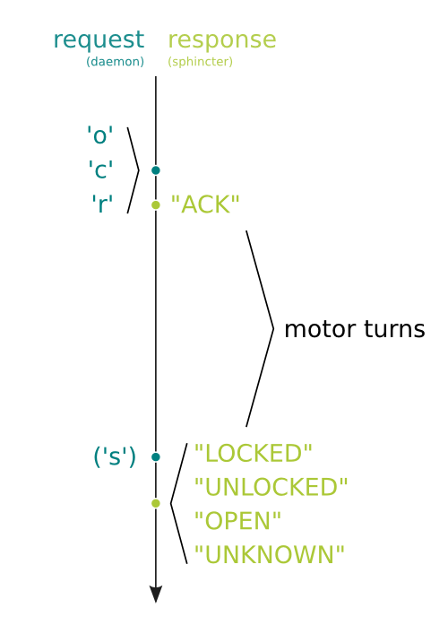

sphincter
=========
an opensource electronic lock for OpenLab

Wie talkst du!?
---------------
how sphincter and its daemon talk to each other over UART

build sphincter
---------------
The folder structure allows you to use [ino](http://inotool.org/ "project page") for building and uploading.
In [arduino](/arduino) folder just type `ino build` to build sphincter and `ino upload` to flash it. `ino clean` removes temporary build files.
